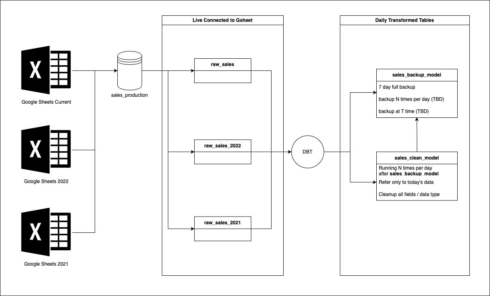

# Alamii DBT

This project is handling [Alamii food](https://alamiifood.com/) sales data



---

## Project Setup

1. [Alamii GCP Project](https://console.cloud.google.com/welcome?project=alamii)
2. [BigQuery](https://console.cloud.google.com/bigquery?project=alamii)
   1. Utilize 2 Connected Sheets
      1. Current Sales Sheet (2023 onwards)
      2. Past Sales Sheet (2022 onwards)
   2. Utilize service account for connecting sheets, managing BigQuery, data transformation
      1. Service Account: `dbt-alamii@alamii.iam.gserviceaccount.com`
      2. Uses JSON Key for the authentication (secret, generated by project owner)

## How to Run

```bash
dbt run
```

## Resources
- Learn more about dbt [in the docs](https://docs.getdbt.com/docs/introduction)
- Check out [Discourse](https://discourse.getdbt.com/) for commonly asked questions and answers
- Join the [chat](https://community.getdbt.com/) on Slack for live discussions and support
- Find [dbt events](https://events.getdbt.com) near you
- Check out [the blog](https://blog.getdbt.com/) for the latest news on dbt's development and best practices
